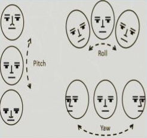
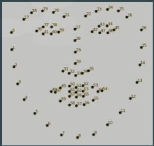

# Face-Liveness
Active Liveness Detection of face using Eye Blink and Face Orientation detection.

This model is able to detect live face by calculating ROLL, PITCH, and YAW of the face.

ROLL, PITCH, and YAW of the face are detected using a pre-trained deep learning model(Trained on Amazon’s Face Detection API ). The model uses Dlib facial landmark model to find 68 facial keypoints that are then feed to the model to find the ROLL, PITCH, and YAW of the user face.

Reference:https://medium.com/analytics-vidhya/face-pose-estimation-with-deep-learning-eebd0e62dbaf
